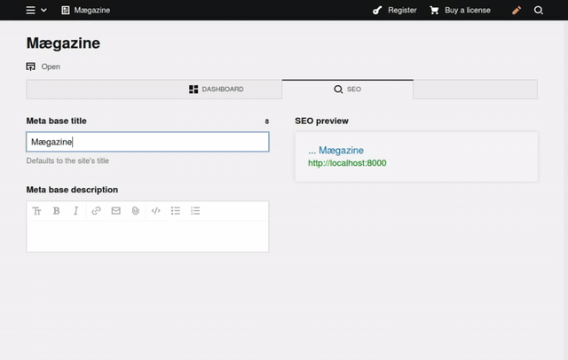

# Kirby SEO Preview Section

  

Configurable & interactive SEO preview section for the Kirby 3 Panel.



--------------------------------------------------------------------------------

## Installation

Choose one of the following installation methods:

**Manually**

[Download](https://github.com/REHvision/kirby-seo-preview-section/archive/master.zip) and copy this repository to `/site/plugins/seo-preview-section`.

**Git submodule**

```shell
git submodule add https://github.com/REHvision/kirby-seo-preview-section.git site/plugins/seo-preview-section
```

**Composer**

```shell
composer require reh/kirby-seo-preview-section
```

## Setup

After installing the plugin, add a `type: seopreview` section to your **site** and/or **page**(s) blueprints and configure the options.

_**NOTE: This plugin only provides a preview and does not generate any meta tags itself!!!**_

So make sure to wire the fields you use for meta tag generation and that the output of the preview mimics your actual meta tags!

### Basic setup

```yml
columns:

  - width: 1/2
    fields:

      metatitle:
        label: Meta title
        type: text

      metadescription:
        label: Meta description
        type: textarea

  - width: 1/2
    sections:

      seopreview:
        type:                seopreview
#       options:             defaults:
        headline:            SEO preview

        titleField:          metatitle        # field key reference
        defaultTitle:        page.title       # query (e.g: page.myCustomSeoTitle)
        separator:           " "
        baseTitle:           site.title       # query (e.g. site.metatitle)

        descriptionField:    metadescription  # field key reference
        defaultDescription:  page.text        # query (e.g: page.text.blocks.html when using the editor)
```

## Options

_TODO: Document the options and APIs that this plugin offers_

## Status & Development

**BEWARE: This is a first public version!**

I'm happy about any feedback (bugs, optimization, suggestions or general feedback)!

**Although this plugin should not break anything, please always test it in your dev environment before using it live !!!**

_TODO: Add instructions on how to help working on the plugin (e.g. npm setup, Composer dev dependencies, etc.)_

## License

MIT
